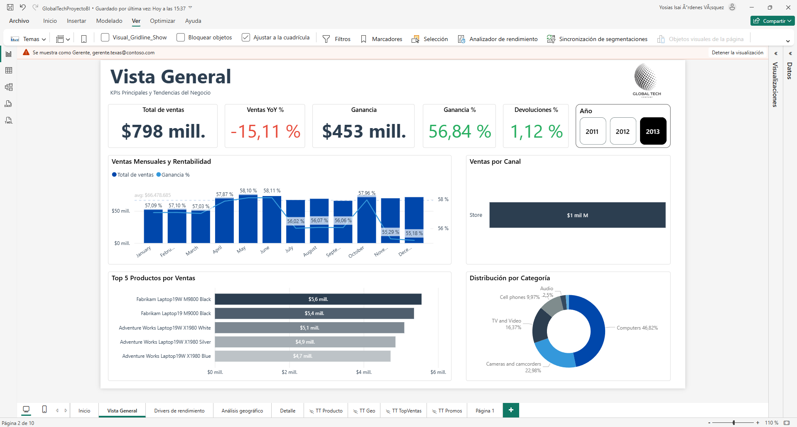
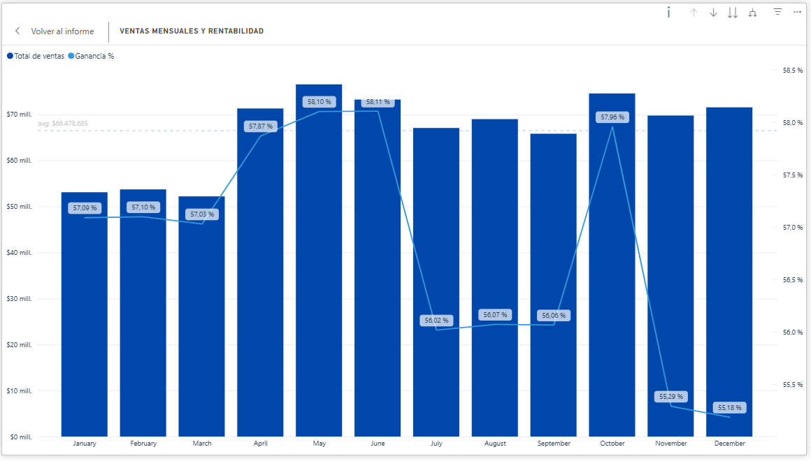
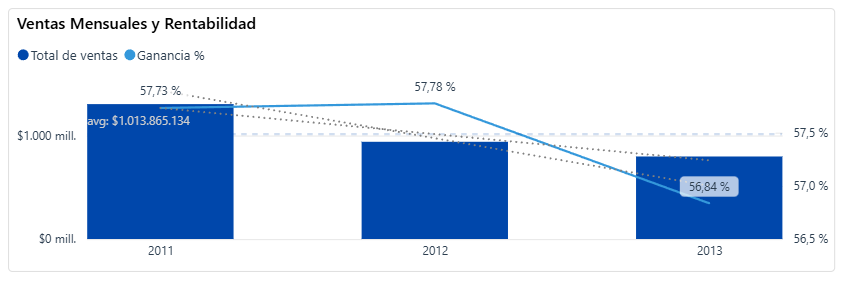
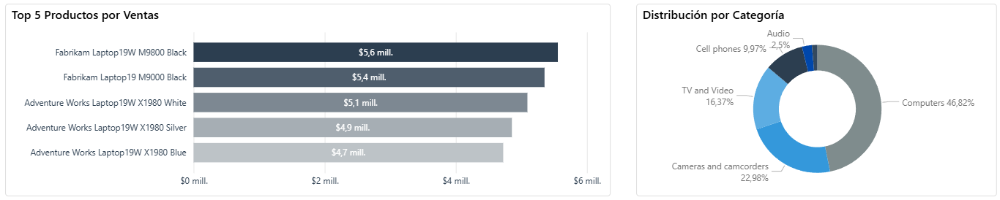
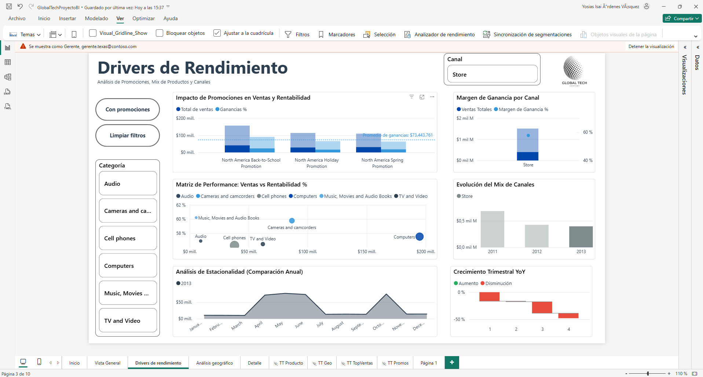
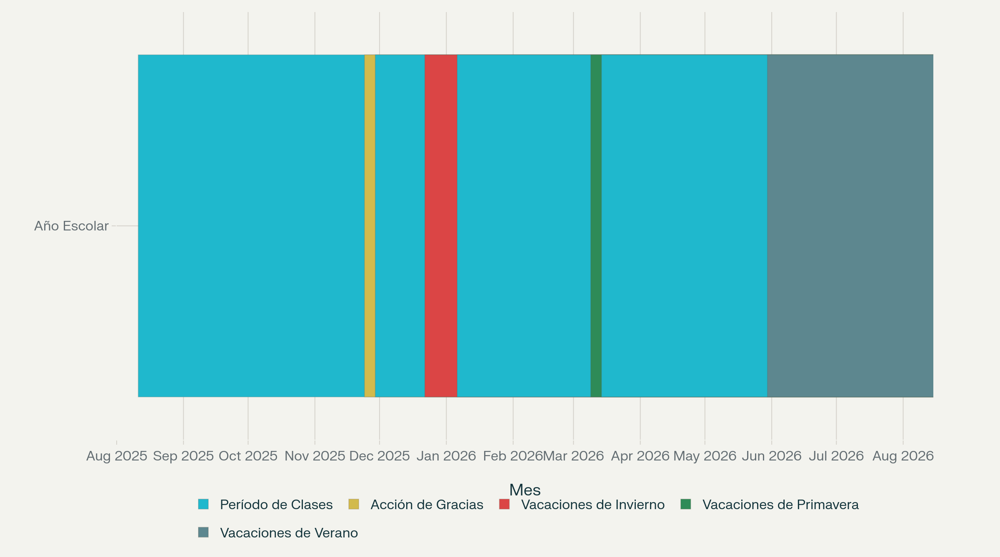
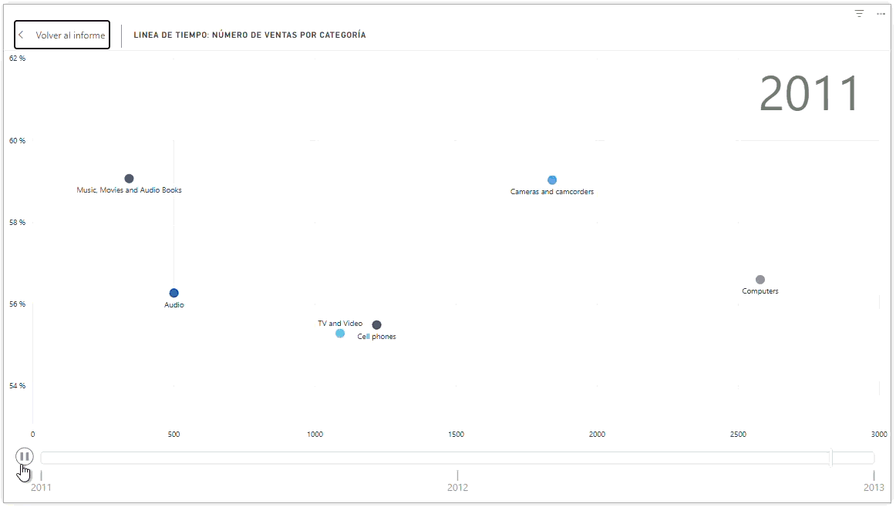
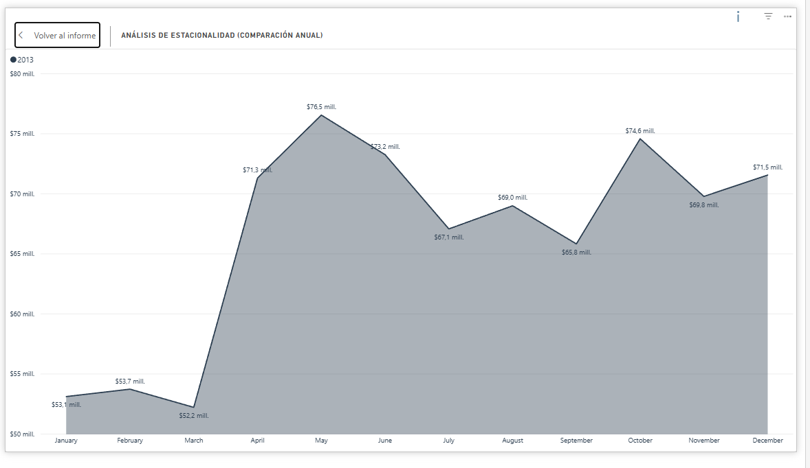

# 🎥 Presentación del Análisis de Ventas

## 📊 Resumen Ejecutivo

Este análisis examina el desempeño de ventas durante 2013, identificando una **crisis de volumen** más que de rentabilidad. A pesar de márgenes saludables del 56.84%, las ventas cayeron un -15.11% interanual, revelando un problema estructural que requiere intervención inmediata.

---

## Página 2: Situación Actual - "¿Qué está pasando?"

### Vista General

### Nota sobre el Margen de Ganancia %

El indicador de **Ganancia %** corresponde a **margen bruto**, calculado como (precio de venta − costo del producto) sobre el precio de venta. En la base Contoso no se incluyen costos operativos como logística, almacenamiento, sueldos, arriendo de tiendas, marketing o servicios básicos, por lo que el margen mostrado (≈56%) es más alto que el margen operativo real de un retail. Aun así, este margen bruto es útil para comparar la **rentabilidad relativa** entre productos, categorías y estrategias promocionales dentro del modelo.

### El Problema: Crisis de Volumen, NO de Rentabilidad

| Métrica | Resultado | Interpretación |
|---------|-----------|-----------------|
| **Margen de Ganancia** | 56.84% | Cada venta es altamente rentable |
| **Caída YoY** | -15.11% | Vendemos significativamente menos |
| **Tasa de Devoluciones** | 1.12% | Calidad de producto y servicio es excelente |

**Pregunta Crítica:** ¿Por qué perdemos volumen si nuestros productos son rentables y tienen baja devolución?

---

### Análisis Trimestral y Mensual

#### Patrones Trimestrales

- **Q2 (Graduaciones):** Trimestre más fuerte con **$221M** en ventas y **58%** de margen
- **Q4 (Black Friday/Navidad):** Débil con **$216M** a pesar de las festividades
- **Octubre:** Pico anual con **$75M**
- **Noviembre-Diciembre:** Caída significativa en volumen y margen

#### Análisis Estacional

El bajo volumen en Q1 se asocia con:
- Inicio de vacaciones de invierno
- Comportamiento de consumidor: menor disposición a salir de casa
- A pesar de promoción de primavera (5% descuento), no generó tracción esperada

---

### Perspectiva Anual: Tendencia a la Baja

**Hallazgo Crítico:** Comparativa 2011 vs 2012-2013

- **2011:** Año base (100%)
- **2012-2013:** Caída acumulada de **23%** en volumen de ventas
- La tendencia a la baja **inició en 2012** y se **mantiene en 2013** con consistencia
- Mientras el volumen colapsa, cada venta individual sigue siendo rentable

**Interpretación:** Pérdida probable de cuota de mercado ante competencia (Retail Online)

---

### Dependencia de Categoría: Riesgo Estructural

#### Top 5 Productos
**100% son laptops** → Dependencia crítica en un único tipo de producto

#### Distribución por Categoría
| Categoría | % del Negocio | Estado | Riesgo |
|-----------|--------------|--------|--------|
| Computers | 46.82% | Declive continuo | crítico |
| Cell Phones | Subrepresentado | En auge | Oportunidad |
| Otras | Distribuidas | Bajo  | Bajo número de ventas |

**Problema Estructural Identificado:**
- Computers en volumen domina casi la mitad del negocio
- Total las categoría está en tendencia a la baja, durante 2013 computers y cell phones son los más demandados.
- Ausencia de categorías compensatorias
- Si caen las ventas de PCs, no hay respaldo de otros productos

---

## Página 3: Análisis de Causas - "¿Por qué está pasando?"

### Drivers de Rendimiento

---

### Calendario Comercial: Alineamiento a Texas

Las promociones están diseñadas según calendario comercial de Texas:

- **Back-to-School** (Julio-Agosto-Septiembre)
  - Alineado con inicio de clases: 11 de agosto
  
- **Holiday Promotion** (24-28 de Noviembre)
  - Thanksgiving y vacaciones de invierno
  
- **Spring Promotion** (Marzo-Abril)
  - Retorno de vacaciones de primavera

---

### Impacto de Promociones en Ventas y Rentabilidad

#### Comparativa: Descuentos vs. Sin Descuentos

| Período | Margen  | Impacto |
|---------|-----------------|--------|
| **No Discount** | $171M |  Mejor rendimiento |
| **Back-to-School** | $113M |  Pérdida de 74% |
| **Holiday Promotion** | $78M | Bajo Impacto |
| **Spring Promotion** | $91M | Rendimiento débil |

**Hallazgo Clave:** Los períodos sin descuento superan significativamente a los períodos con promociones agresivas.

---

### Análisis de Mix de Productos

#### Dinámicas Identificadas

1. **Computers** (Categoría Dominante)
   - Mayor volumen en dólares absolutos
   - Tendencia: Declive continuo
   - Riesgo: Única fuente de ingresos principal

2. **Cell Phones** (Burbuja Grande)
   - Lidera en unidades vendidas
   - Margen saludable: 55%
   - Limitación: Insuficiente para compensar caída de Computers

**Conclusión:** Necesidad urgente de impulsar categorías complementarias

---

### Análisis Estacional: Meses con vs. sin Promoción

#### Comparativa Mensual

| Período | Tipo | Ventas | Observación |
|---------|------|--------|------------|
| **Abril-Mayo-Junio** | Sin promoción | Superiores |  Mejor performance |
| **Octubre** | Sin promoción | **$76.5M** (Mayo) | Pico previo a Q4 |
| **Julio** | Back-to-School | **$67M** | Caída durante descuentos |
| **Noviembre-Diciembre** | Holiday | Débiles | A pesar de festividades |

**Patrón Consistente:** Los meses sin promoción superan a los meses con descuentos agresivos

---

### Crecimiento Trimestral: El Golpe de Back-to-School

| Trimestre | Promoción | Crecimiento YoY | Análisis |
|-----------|-----------|-----------------|----------|
| **Q1** | Spring Promotion | Negativo | Inicio débil |
| **Q2** | Sin promoción | **-1%** | Más resistente |
| **Q3** | Back-to-School | **-22.7%** | PEOR trimestre |
| **Q4** | Holiday | Negativo | Débil a pesar de festividades |

**Hallazgo Crítico:** El único trimestre que resistió fue Q2 (sin promociones activas). Back-to-School causó el peor desempeño del año con -22.7% YoY.

---

## Conclusiones y Recomendaciones

### ⚠️ Limitación del Análisis

> Dado que la base de datos no incluye información de empleados, no podemos atribuir directamente la caída a cambios en el equipo de ventas. Sin embargo, la **caída uniforme durante todo el año sugiere un problema sistémico**. Posibles causas:
> 
> - Rotación de vendedores clave
> - Cambios en la estrategia comercial
> - Factores externos del mercado (competencia Retail Online)

---

### Recomendaciones

#### 1. **Diversificación de Categorías** 

**Problema:**
- 46.82% del negocio depende de Computers
- Computers está en declive año a año
- Concentración del riesgo crítica

**Solución:**
- Impulsar venta de UNIDADES en categorias cameras and camcorders y Music,Movies and audiobooks.
- Desarrollar nuevas categorías complementarias
- Rreducir dependencia de Computers

---

#### 2. **Optimización de Estrategia Promocional** 

**Problema Identificado:**
- Descuentos promedio de 15% erosionan margen sin recuperar volumen
- Holiday promotion generó -25.56% YoY (PEOR resultado)
- Meses sin descuento superan meses con promociones

**Solución:**

- **Replantear** Holiday Promotion (débil a pesar de festividades)
- Considerar programa de fidelización en lugar de descuentos agresivos
- Evaluación urgente: El problema se arrastra desde 2012 pero nunca fue identificado

---

#### 3. **Auditoría del Equipo Comercial** 

**Hallazgos:**
- Caída agresiva iniciada en 2012 (-23% acumulado)
- Caída uniforme durante todo 2013 
- Sugiere problema sistémico, no variación estacional

**Solución:**
- Auditoría inmediata de estructura y capacitación de equipo de ventas
- Revisar cambios de personal clave en 2012
- Benchmarking contra competencia Retail Online
- Entrevistas con equipo de ventas para validar hipótesis

---
**Última Actualización:** Enero 2014
**Analista:** Yared Levi
**Estado:** Requiere Acción Inmediata
